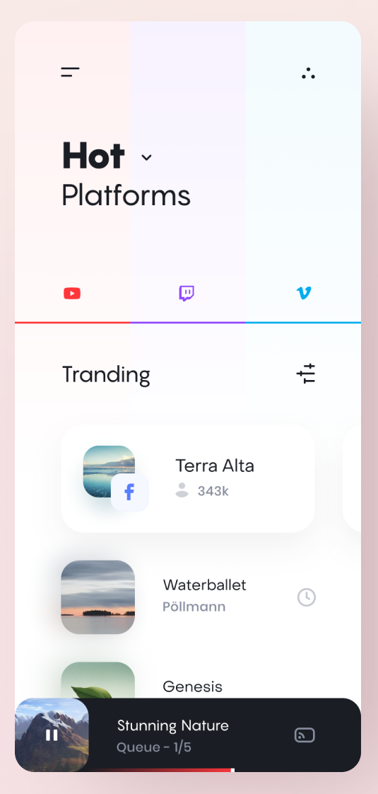
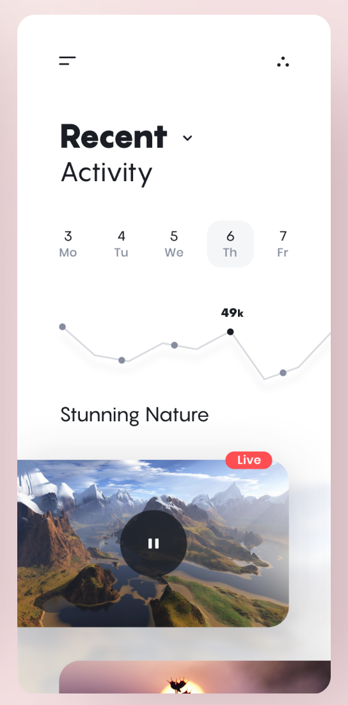

# Video Platforms Rating App 📺

This is another minor mobile application built in Flutter with the purpose to re-learn Flutter and all the widgets it provides 🔥.

This repo is a continuation of understanding app development with Flutter and Dart. This is my weekly goal for **week 34 2020**, where the focus was to add page interactivity to browse between pages. Furthermore, for now Material Design will not be used, and the WidgetsApp will utilised instead. Messing around with graphs and their state is also a goal.

#### Flutter

To install Flutter for your Operation System, Google has a great documentation for exactly that. Click the link below that matches your operating system.

- [Windows](https://flutter.io/setup-windows/)
- [Mac OS](https://flutter.io/setup-macos/)
- [Linux](https://flutter.io/setup-linux/)

I myself use Windows, and with that, I for the moment can only emulate Flutter for Android applications. To emulate for both Android and iOS, you will need a MacBook. For the IDE, I develop my stuff in Visual Studio Code.
- [VSCode](https://flutter.io/get-started/editor/#vscode)

#### The App Itself
The Discover Movies Application is developed with the following design in mind, where uixNinja did not provide any needed fonts, nor color schemes.  
https://dribbble.com/shots/7938976-Figma-Rocks

The application was developed to work on every phone. The result will be showcased below on a Pixel 2, with API 28.

The following is a table for what Flutter widgets I utilised:

| Flutter Widgets in use (listed randomly)  | |
| - | - |
| Scaffold | Stack |
| Column | Row |

#### Contributions

You are always welcome to contact me for any improvement, contributions and so on. For any issues, just reach out, and I will remove whatver that is causing problems.

- More to come
